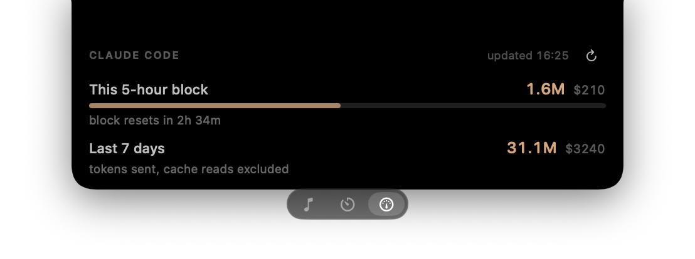

# Islet

Hover your MacBook's camera notch and it grows into a panel. Move away and it
disappears completely.




**Music** — now playing from Spotify or Apple Music: large artwork, a scrubbable
progress bar and transport controls. Click the artwork to jump to the app it is
playing in.

**Claude** — how much of the current Claude Code five-hour block you have spent,
beside the transport. Click it for the weekly window too. The column and its tab
disappear entirely if you don't use Claude Code.

**Timer** — a pomodoro with Focus and Break modes. Plus battery alerts when the
charger goes in or out, and an option to stay visible on the lock screen.

While something is playing, a small summary sits beside the notch:


## Install

Needs macOS 14+ and the Xcode Command Line Tools.

```bash
git clone https://github.com/KaanCan1/Islet.git
cd Islet
make install
```

That's it — the app is built, copied to `/Applications` and launched. It lives in
the menu bar with no Dock icon, and every setting is in that menu. Use `make run`
to try it without installing.

## Permissions

On first launch macOS asks for **Automation** ("Islet wants to control Spotify") —
the music panel needs it. **Accessibility** is only requested if you use the
transport buttons while something other than Spotify or Music is playing. Battery
readings need no permission.

Islet also asks once, itself, before reading anything under `~/.claude`. macOS
does not gate that directory, so nothing would stop an app reading it silently;
answering "Not now" leaves the feature off and nothing is read.

## Notes

- Now playing comes from AppleScript, not private APIs: macOS 15.4 closed
  `MediaRemote` to unentitled apps.
- The Claude figures come from `~/.claude/projects/*.jsonl`, read locally — only
  timestamps, token counts and model names, never message content, and nothing
  leaves the machine. Islet asks before it reads any of it, and the whole thing
  stays hidden if you have never used Claude Code.
- **The real figures come from Claude's own usage endpoint** when it can be
  reached: `GET /api/oauth/usage` on api.anthropic.com, the same one `/usage`
  reads, which answers with the actual utilisation and reset time. It needs the
  OAuth token the `claude` CLI writes to the login keychain. If you only ever run
  Claude Code from the desktop app there is no such token — that install keeps its
  session in the app's own encrypted storage — and Islet falls back to estimating
  from transcripts. Log in once with the CLI and it switches over on its own.
- **The estimate measures time, not tokens.** Nothing on disk says what Claude
  counts, so it was worked out from the moments this account was cut off: across
  those, the tokens standing in the window varied by 3.5x (1.2M to 4.3M) while
  the minutes spent varied far less. Against a figure read out of `/usage`, the
  time measure predicted 72% where the truth was 77%; tokens were out by up to 2x.
- **The estimated ceiling is learned, not configured**: the largest usage standing
  in a window when Claude Code cut you off. Run past it without being cut off and
  it moves up, so a plan change works its way in on its own. Two rejections are
  required before any percentage appears — the single seven-day rejection here
  predated a "+50% weekly limits" promo and would have claimed 99% against a real
  33%. Expect roughly a quarter of spread while estimating; the endpoint above is
  the only exact source.
- Reset times land on ten-minute boundaries, and a recorded rejection carries the
  server's own. Both are used, which took the average error against known resets
  from 6.2 minutes to 5.0.
- Scanning is incremental: only bytes appended since the last pass are
  read, so just the first scan is slow (about 12 seconds for 380 MB of
  transcripts, on a background thread). It refreshes every minute and the panel
  has a refresh button.
- Displays without a notch get a virtual one at the top centre of the screen.
- In full-screen apps macOS slides the menu bar down the moment the cursor
  touches the top edge. That's the system, not Islet. To stop it: System Settings
  → Control Center → Menu Bar → "Automatically hide and show the menu bar" → Never.
- `./dist/Islet.app/Contents/MacOS/Islet --diagnose` prints every screen, the
  detected notch size, permission state and the raw now-playing payload.

## License

MIT — see [LICENSE](LICENSE).
