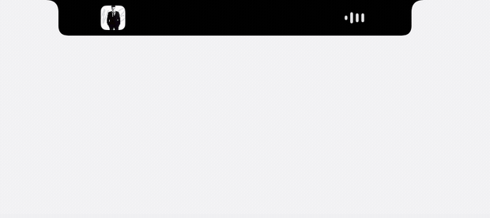
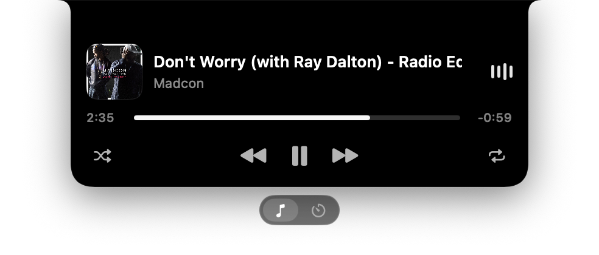
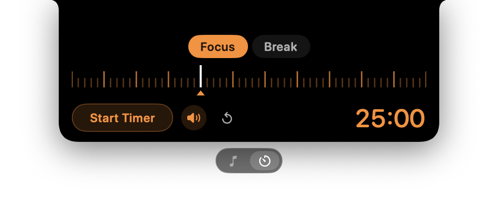

# Islet

Hover your MacBook's camera notch and it grows into a panel. Move away and it
disappears completely.






**Music** — now playing from Spotify or Apple Music, with artwork, a scrubbable
progress bar and transport controls. Click the artwork to jump to the app it's
playing in. **Timer** — a pomodoro with Focus and Break modes. Plus battery
alerts when the charger goes in or out, and an option to stay on the lock screen.

While something is playing, a small summary sits beside the notch:


## Install

Needs macOS 14+ and Xcode or the Command Line Tools.

```bash
make install
```

That builds `dist/Islet.app`, copies it to `/Applications` and launches it. Use
`make run` to build and run it in place instead. Islet lives in the menu bar with
no Dock icon, and every setting is in that menu.

## Permissions

On first launch macOS asks for **Automation** ("Islet wants to control Spotify") —
the music panel needs it. **Accessibility** is only requested if you use the
transport buttons while something other than Spotify or Music is playing. Battery
readings need no permission.

## Notes

- Now playing comes from AppleScript, not private APIs: macOS 15.4 closed
  `MediaRemote` to unentitled apps.
- Displays without a notch get a virtual one at the top centre of the screen.
- In full-screen apps macOS slides the menu bar down the moment the cursor
  touches the top edge. That's the system, not Islet. To stop it: System Settings
  → Control Center → Menu Bar → "Automatically hide and show the menu bar" → Never.
- `./dist/Islet.app/Contents/MacOS/Islet --diagnose` prints every screen, the
  detected notch size, permission state and the raw now-playing payload.

## License

MIT — see [LICENSE](LICENSE).
